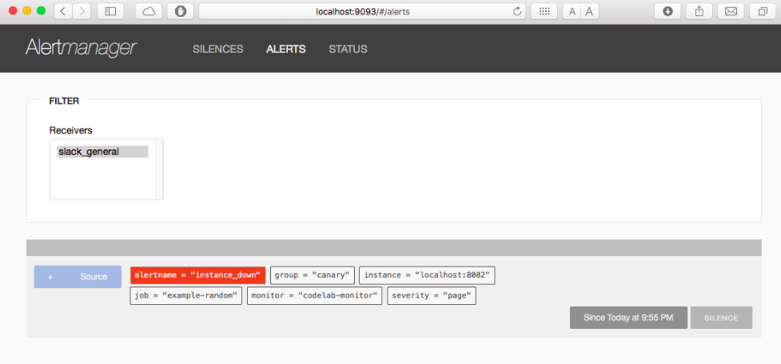

Ansible Role: osm_alertmanager
==============================

>Alertmanager is tool that handles alerts sent by Prometheus. It gets the alert from Prometheus server and make groups of alerts on the basis of labels and after that it will forward the alert to different reciever such as Email, PagerDuty, Slack.

>Alertmanager is configured via using command-line flags and a configuration while. While command line configure system parameters, the configuration file contains the information like recievers and routing.

Version History
---------------

|**Date**| **Version**| **Description**| **Changed By** |
|----------|---------|---------------|-----------------|
|**May  2020** | v0.0.1 | Initial Draft | [Abhishek Dubey](abhishek.dubey@opstree.com) |
|**July 2020** | v0.1.0 | Added Integration of Slack, Google chat| [Mahesh Kumar](mahesh.kumar@opstree.com) |


## Requirements

There is no particular requirment for running this role. As this role is platform independent for centos 6 or 7 and ubuntu 14 or 16. The only dependency for centos 6 is libselinux-python and we have included that as well.
The basic requirments are:-
- Centos/Ubuntu Server
- Python should be installed on the target server
- 9093 port should be open in your server

## Role Variables

```yaml
---
# defaults file for alertmanager
version: "0.20.0"
base_url: "https://github.com/prometheus/alertmanager/releases/download"
alertmanager_dir: "alertmanager-{{ version }}.linux-amd64"
download_url: "{{ base_url }}/v{{ version }}/{{ alertmanager_dir }}.tar.gz"
alertmanager_user: "alertmanager"
alertmanager_group: "alertmanager"
prometheus_user: "prometheus"
prometheus_group: "prometheus"
binary_path: "/usr/local/bin"

# Email Notification
email_integration: "no"
sender_email: "send.test@example.com"
alertmanager_email: "alertmanager.test@example.com"
smtp_server: "smtp.gmail.com:587"

# Slack Integration
slack_integration: "yes"
slack_webhook: "https://hooks.slack.com/services/T00000000/B00/XXXXXX"
slack_channel_name: "alerting-channel"

# Google Chat Integration
google_chat_integration: "yes"
calert_home: "/opt/calert"
calert_base_url: "https://github.com/mr-karan/calert/releases/download"
calert_url: "{{ calert_base_url }}/v1.2.1/calert_1.2.1_linux_amd64.tar.gz"
google_chat_room: "google-room-name"
room_webhook: "google-chat-room-webhook"
```

You can define any prometheus version that you want to install on your server.

#### Mandatory Variables

|**Variable**|**Default Value**|**Possible Values**|**Description**|
|------------|-----------------|-------------------|---------------|
|version | "0.20.0" | Any Version | Alertmanager will be downloaded from github releases, so you have to define version |
|alertmanager_user | alertmanager | Any User | Alertmanager Service User|
|alertmanager_group | alertmanager | Any Group | Alertmanger Service Group |
|prometheus_user | prometheus  | Any User | Prometheus Service User, Owner of Node Specific Rules |
|prometheus_group | prometheus | Any Group | Prontheus Service Group, give permision to Node Specific Rules file|

#### Optional Variables

|**Variable**|**Default Value**|**Possible Values**|**Description**|
|------------|-----------------|-------------------|---------------|
|base_url | https://github.com/prometheus/alertmanager/releases/download | Base url  of Alertmanager's Download link | Alertmanger Download link Base URL |
|alertmanager_dir | alertmanager-{{ version }}.linux-amd64 | Alertmanger Dir Name | Alertmanger Directory after Extracting |
|download_url | {{ base_url }}/v{{ version }}/{{ alertmanager_dir }}.tar.gz | Alertmanger Download Link | Github url to Donwload Alertmanger Binary |
|binary_path | /usr/local/bin | Any Path | Alertmanger Binary Path |
|email_integration| "no" | "yes"/"no" | Enable/Disable Email integration with Alertmanager |
|sender_email | "send.test@example.com" | Any Email Address | Email Address use to send alerts |
|alertmanager_email | "alertmanager.test@example.com" | Any Email Address | Alertmanger's Email Address |
|smtp_server | "smtp.gmail.com:587" | smtp_server address with port | Email smpt server use by Alertmanger |
|slack_integration | "no" | "yes"/"no" | Enable/Disable Slack integration with Alertmanager |
|slack_webhook | "https://hooks.slack.com/services/T00000000/B00/XXXXXX" | Any Channel Webhook | Slack Channel Webhook use to integrate Slack Channel with Alertmanger |
|slack_channel_name | "alerting-channel" | Any Slack Channel Name | Slack Channel Name use to send Alerts |
|google_chat_integration | "yes" | "yes"/"no" | Enable/Disable Google Chat integration with Alertmanager |
|calert_home | "/opt/calert" | Calert Service home path | Calert Service home where calert service binary and configuration files will be |
|calert_base_url| "https://github.com/mr-karan/calert/releases/download" | Calert service Download Link | Calert Binary's URL |
|calert_url | "{{ calert_base_url }}/v1.2.1/calert_1.2.1_linux_amd64.tar.gz" | Calert service Download Link | Github url to Donwload Calert Binary |
|google_chat_room | "google-room-name" | Any Google Chat Room | Google Chat Room use to send Alerts |
|room_webhook| "google-chat-room-webhook" | Any Google Chat Room's Webhook | Google Chat Room's Webhook use to integrate with Calert Service |

Supported OS
------------
  * CentOS:7
  * CentOS:6
  * Ubuntu:xenial
  * Ubuntu:trusty

Dependencies
------------
- prometheus-server
- libselinux-python

## Example Playbook

Here is an example for the main playbook

```yaml
---
- hosts: alertmanager
  roles:
    -  alertmanager
```
Here We are using root as an user but you can use different user, For that you just have to make become value true. Something like this:-
```yaml
---
- hosts: alertmanager
  become: true
  roles:
    -  alertmanager
```

For inventory you can create a host file in which you can define your server ip, For example:-

```
[alertmanager]
10.1.1.100

[prometheus]
10.1.1.100
```
Note: Please Add Prometheus Server Also, Add Configuration of Alert Manager in prometheus.yml file

You can simply use this role by using this command
```shell
ansible-playbook -i hosts site.yml
```

Directory Structure of Role
---------------------------
This is the directory structure of role:-
```bash
osm_alertmanager
├── defaults
│   └── main.yml
├── files
│   ├── alertmanager.init
│   ├── email.tmpl
│   ├── google_chat_calert.tmpl
│   ├── node_exporter.rules
│   └── telegraf_node.rules
├── handlers
│   └── main.yml
├── README.md
├── site.yml
├── tasks
│   ├── calert.yml
│   ├── debian.yml
│   ├── main.yml
│   ├── prerequisites.yml
│   └── redhat.yml
└── templates
    ├── alertmanager.service.j2
    ├── alertmanager.yml.j2
    ├── calert.service.j2
    └── calert.toml.j2
```

Role Variables
--------------

|**Variable**| **Default Value**| **Description**|
|---------|------------|-----------|
|alertmanager_version| "0.15.1"| The version of alertmanager version, this variable you have to give because it will download alertmanager from github releases|
|sender_email| "send.test@example.com"| The email id you want to send alerts||
|alertmanager_email| "alertmanager.test@example.com" | The email id from which you want to send mail to recievers|
|smtp_server | "smtp.gmail.com:587" | smtp server host name|

Inventory
----------
An inventory should look like this:-
```ini
[alertmanager]                 
192.168.1.198    ansible_user=ubuntu   
192.168.3.201    ansible_user=opstree 
```

Example Playbook
----------------
* Here is an example playbook:-
```yaml
---
- hosts: alertmanager
  become: true
  roles:
    -  alertmanager
```
* ansible-playbook -i inventory alrtmanager.yml

**After successful installation of alertmanager, you can browse through the alertmanager url and see the web interface**


License
-------
BSD

References
----------
- **[software](https://prometheus.io/docs/alerting/alertmanager/)**

Author Information
------------------
This role is written and maintained by [Abhishek Dubey](https://gitlab.com/abhishek-dubey). If you have any queries and sugesstion, please feel free to reach.

Email ID:- [abhishek.dubey@opstree.com]()
